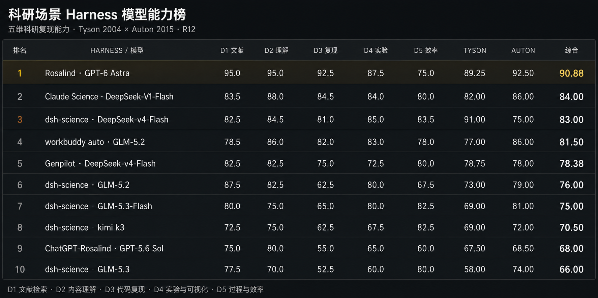
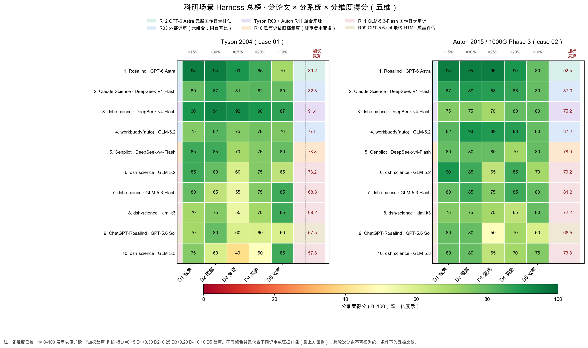

# 科研场景 Harness 总榜

更新至 **2026-09-07 · R12**。每个 Harness × LLM 方案一行（不区分评审轮次批次）；同一方案以**最新一次评估**为准，不同轮次按同一标准视为可比，历史分见各轮次记录。按 Tyson 2004 与 Auton 2015 / 1000 Genomes Phase 3 两项评估的综合分降序排列。

| 排名 | Harness / 方案 | LLM | Tyson 2004 | Auton 2015 | 综合分 /100 | 评估依据 |
|---:|---|---|---:|---:|---:|---|
| 1 | Rosalind | GPT-6 Astra | 89.25 | 92.50 | **90.88** | [R12](../evaluations/round-12-rosalind-6astra-workdir-audit.md) |
| 2 | Claude Science | DeepSeek-V1-Flash | 82 | 86 | **84.00** | [R03](../evaluations/round-03-six-system-combined.md) |
| 3 | dsh-science | DeepSeek-v4-Flash | 91 | 75 | **83.00** | Tyson [R03](../evaluations/round-03-six-system-combined.md) / Auton [R11](../evaluations/round-11-dsh-science-workdir-audit.md) |
| 4 | workbuddy auto | GLM-5.2 | 77 | 86 | **81.50** | [R03](../evaluations/round-03-six-system-combined.md) |
| 5 | Genpilot | DeepSeek-v4-Flash | 78.75 | 78.00 | **78.38** | [R10](../evaluations/round-10-genpilot-ds-v4-flash.md) |
| 6 | dsh-science | GLM-5.2 | 73 | 79 | **76.00** | [R11](../evaluations/round-11-dsh-science-workdir-audit.md) |
| 7 | dsh-science | GLM-5.3-Flash | 69 | 81 | **75.00** | [R11](../evaluations/round-11-dsh-science-workdir-audit.md) |
| 8 | dsh-science | kimi k3 | 69 | 72 | **70.50** | [R11](../evaluations/round-11-dsh-science-workdir-audit.md) |
| 9 | ChatGPT-Rosalind | GPT-5.6 Sol | 67.5 | 68.5 | **68.00** | [R09](../evaluations/round-09-chatgpt-rosalind-5.6sol-two-reports.md) |
| 10 | dsh-science | GLM-5.3 | 58 | 74 | **66.00** | [R11](../evaluations/round-11-dsh-science-workdir-audit.md) |

> 收录说明：Rosalind × GPT-6 Astra 为 R12 完整工作目录审计口径，证据覆盖报告、脚本、原始/派生数据、环境锁、日志、测试和 provenance；本轮做了静态入口检查与输入哈希复核，但未做全量 clean-room 重算，故不标 E4。四个 dsh-science 模型为 R11 工作目录代码审计口径；dsh-science × DeepSeek-v4-Flash 的 **Auton 由 R11 重评（75，此前 91）**，Tyson 保留 R03（91，R11 未重评）。ChatGPT-Rosalind × GPT-5.6 Sol 是不同模型版本的旧方案，保留其 R09 成绩。历史分与详尽扣分依据见各轮次记录。

## 分论文 × 分系统 × 分维度得分

上面的总榜只列了每个方案的综合分。下面的图把两项论文（Tyson 2004 与 Auton 2015 / 1000 Genomes Phase 3）各自的**五维得分**（检索 15%、理解 30%、复现 25%、实验 20%、效率 10%）逐项展开，便于看每个方案在每个维度上的强、弱项：

> 各维度已统一为 0–100 展示以便并读；“加权复算”列按 `得分 = 0.15·D1 + 0.30·D2 + 0.25·D3 + 0.20·D4 + 0.10·D5` 复算，仅作参考，与总榜的综合分（双项目分均值）口径不同。不同评审轮的评分尺度、争议项与历史分统一在[评分口径与争议](leaderboard-notes.md)披露；总榜只列每个系统的最新结果。原始分维度数值见各轮次记录（[R03](../evaluations/round-03-six-system-combined.md) / [R09](../evaluations/round-09-chatgpt-rosalind-5.6sol-two-reports.md) / [R10](../evaluations/round-10-genpilot-ds-v4-flash.md) / [R11](../evaluations/round-11-dsh-science-workdir-audit.md) / [R12](../evaluations/round-12-rosalind-6astra-workdir-audit.md)）；图表由 `scripts/leaderboard_dimension_chart.py` 生成。

## 计分说明

- 单项采用五维评分：检索 15%、理解 30%、代码复现 25%、实验与可视化 20%、过程与效率 10%；统一展示为百分制。
- 综合分取两项已收录项目分的平均值；同一方案保留最新评估分（最新取代旧，不同轮次按同一标准视为可比）。
- 完成双项目评估即可入总榜。评审来源、证据范围和争议另行披露，不因此排除入榜；名次不代表统一条件下的受控比较。
- 单论文、课件和评审稿不混入双项目综合分，详见补充说明与各轮次记录。

[评分口径、争议与单项成绩](leaderboard-notes.md) · [各 Round 评测记录](../evaluations/README.md) · [评分标准](rubric.md) · [评测协议](benchmark-protocol.md)
